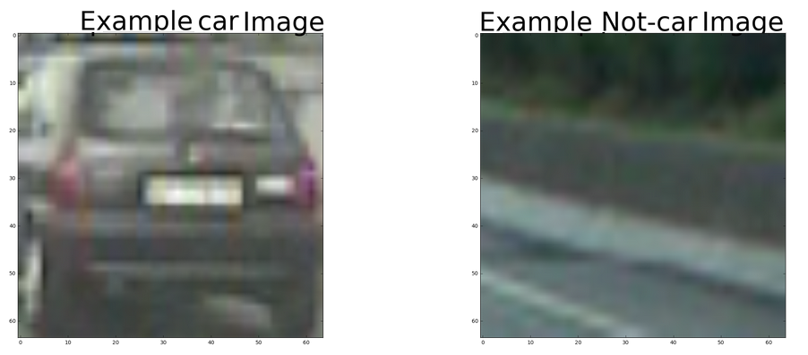
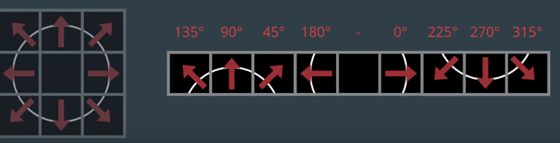
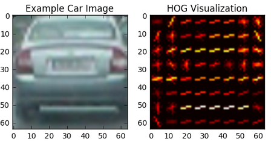
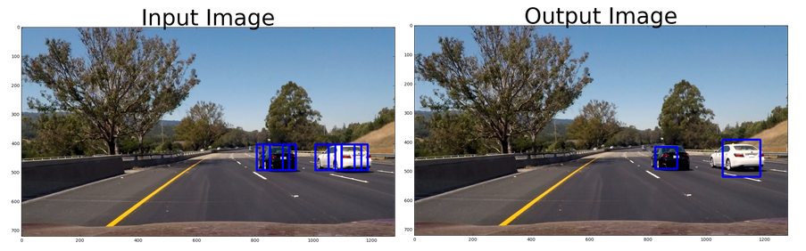
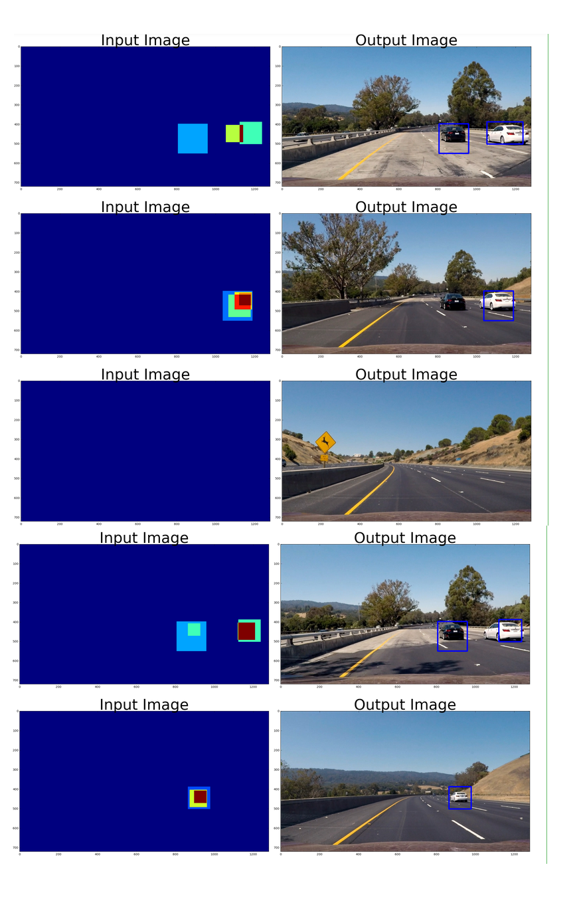

<?xml version="1.0" encoding="UTF-8"?><html xmlns="http://www.w3.org/1999/xhtml">
  <body class="c14">
    (program video output)
    <h1 class="c26" id="h.qze4dlw21i4d">
      Vehicle Detection and track
    </h1>
    <h2 class="c24" id="h.52013ybplk45">
      Overview:
    </h2>
    

      In this project I will be using computer vision and deep learning techniques to detect and track vehicles on the road.
    

    

      Computer vision is used for control and manual tuning of objects in the video frames. With the help of Linear SVM classifier we can get a robust approach to improve the accuracy of our computer vision algorithm.    
    

    

      
    

    

    

      
    

    <h2 class="c24" id="h.yd5ehac7qkvb">
      Project pipeline 
    </h2>
    <ul class="c19 lst-kix_nz5mknjr6itm-0 start">
      <li class="c5 c13">
        Histogram of Oriented Gradients (HOG)
      </li>
    </ul>
    <ul class="c19 lst-kix_nz5mknjr6itm-1 start">
      <li class="c5 c7">
        Perform a Histogram of Oriented Gradients (HOG) feature extraction on a labeled training set of images and train a classifier Linear SVM classifier
      </li>
    </ul>
    <ul class="c19 lst-kix_nz5mknjr6itm-0">
      <li class="c5 c13">
        Image augmentation
      </li>
    </ul>
    <ul class="c19 lst-kix_nz5mknjr6itm-1 start">
      <li class="c5 c7">
        Normalize features and randomize a selection for training and testing.
      </li>
    </ul>
    <ul class="c19 lst-kix_nz5mknjr6itm-0">
      <li class="c5 c13">
        Train a linear svm classifier to search for vehicles in images
      </li>
      <li class="c5 c13">
        Implement a sliding-window technique
      </li>
      <li class="c5 c13">
        Heat map
      </li>
    </ul>
    <ul class="c19 lst-kix_nz5mknjr6itm-1 start">
      <li class="c5 c7">
        Used heat map to reject outliers as it collects recurring detections frames and followed by detected vehicles.
      </li>
    </ul>
    <ul class="c19 lst-kix_nz5mknjr6itm-0">
      <li class="c5 c13">
        Bounding box
      </li>
    </ul>
    <ul class="c19 lst-kix_nz5mknjr6itm-1 start">
      <li class="c5 c7">
        Estimates a bounding box for vehicles detected.
      </li>
    </ul>
    <ul class="c19 lst-kix_nz5mknjr6itm-0">
      <li class="c5 c13">
        Run your pipeline on a video stream
      </li>
    </ul>
    

      
    

    

    

      
    

    <h1 class="c27" id="h.n0rwgthx2661">
      Data set
    </h1>
    

      Data set is provided by Udacity. Here are links to the labeled data for
      
        <a class="c4" href="https://www.google.com/url?q=https://s3.amazonaws.com/udacity-sdc/Vehicle_Tracking/vehicles.zip&amp;sa=D&amp;ust=1502661329599000&amp;usg=AFQjCNFEs4aO-461tf8S-w-M8DY1V8iiLA"> vehicle</a>
      
       and
      
        <a class="c4" href="https://www.google.com/url?q=https://s3.amazonaws.com/udacity-sdc/Vehicle_Tracking/non-vehicles.zip&amp;sa=D&amp;ust=1502661329599000&amp;usg=AFQjCNHO_a74Tutee1XeMg1ZszcbNrBZxg"> non-vehicle</a>
      
      . Each folder contains images and a csv file containing all the labels and bounding boxes. To add vehicle images to your training data, you'll need to use the csv files to extract the bounding box regions and scale them to the same size as the rest of the training images.
    

    

      
    

    

      
        
      
    

    <h2 class="c15" id="h.keitt150eipm">
      Histogram of Oriented Gradients (HOG)
    </h2>
    

      Gradient Features - It allows you to get the shape of the object, so later you can create an independent signature from color and size. In general terms the gradient allow you recognize the direction (gradient direction) in which the color pixels are changing. This technique is call HOG Features. (histogram of oriented gradients) 
    

    

      
        
      
    

    <h4 class="c23" id="h.b0zfj726mzs6">
      #HOG call from the search car function
    </h4>
    

      hog1 = get_hog_features(ch1, orient, pix_per_cell, cell_per_block, feature_vec=False)
    

    

      
    

    

      The code for this step is contained in the first code cell of the IPython notebook (under Search Car function,  get_hog_features can be found in lines 107 to 120 lesson_Functions.py)
    

    

      The bottom image is an example of the data set used for classification. Example of
      
        <a class="c4" href="https://www.google.com/url?q=http://www.pyimagesearch.com/2015/11/16/hog-detectmultiscale-parameters-explained/&amp;sa=D&amp;ust=1502661329602000&amp;usg=AFQjCNFVj2fw4qb-GTJYnI1isBrrOn0rJg"> HOG</a>
      
    

    <h3 class="c10" id="h.r6t83uk6himv">
      Tuning HOG parameters
    </h3>
    

      
    

    

      
    

    

      
    

    

      I started with few samples of vehicles and non-vehicles images, to explored parameter tuning. After tuning paraments I ran a classifier to identify how the HOG features changed the predictions of the system.  
    

    

      
    

    

      The paraments that were giving me positive results are YCrCb color space and HOG parameters of orientations=8, pixels_per_cell=(8, 8) and cells_per_block=(2, 2):
    

    

      
        
      
    

    <h2 class="c24" id="h.9hexc493s1yq">
      Sliding Window Search
    </h2>
    

      cv2.matchTemplate() - it compares two images to find out how close they are from each other 
    

    

      cv2.minMaxLoc() - extracts the location for the best match
    

    

      cv2.resize() - You can use it to scale a color image
    

    

      
    

    

      This two functions will not work because the cv2.matchTemplate can only find very close matches, and changes in size or orientation of a car make it impossible to match with a template. 
    

    <h3 class="c10" id="h.clwjk33yg8a8">
      Region of search:
    </h3>
    

      The region of the image to search for a car, starts a little over halfway down the image (y_start_stop=[int(image.shape[0]/2), image.shape[0]-50]). The image cut allow us to search cars on the road, and not on the sky or trees. 
    

    <h3 class="c10" id="h.c7odt6umacds">
      Tiles Size:
    </h3>
    

      The size of the tiles was determined to be 64 so it can match the sampling rate 8 cells and 8 pix per cell.
    

    

      
    

    <h2 class="c24" id="h.vgcxhj2qyv3q">
      Sliding window implementation search
    </h2>
    

      When it comes to sliding a window across the video frame the car size will be different. In order to adapt to this circumstance, 
      I used the scale method, instead of changing the window size. The scale method resizes the original image to fit a window. This technique was borrowed from Udacity's Self-driving class. 
    

    

      
    

    

      (implementation can be found under find_cars function in 
      
        <a class="c4" href="https://www.google.com/url?q=https://ec2-52-53-212-62.us-west-1.compute.amazonaws.com:8888/notebooks/notebook/CarND-Vehicle-Detection/source_code/Vehicle_Detection.ipynb&amp;sa=D&amp;ust=1502661329608000&amp;usg=AFQjCNF7yUn9mq3AFwFGyQJUJyyB2NadMw">Vehicle_Detection.ipynb</a>
      
      )          
    

    

              #slide in the horizontal axis  
    

    

              for xb in range(nxsteps):
    

    

      #slide in the vertical axis  
    

    

                          for yb in range(nysteps):
    

    

                              ypos = yb*cells_per_step
    

    

                              xpos = xb*cells_per_step
    

    

      
    

    <h2 class="c24" id="h.6py0tggq0q0w">
      Training a classifier
    </h2>
    

      The classifier is trained using the HOG features. The 
      
        <a class="c4" href="https://www.google.com/url?q=http://scikit-learn.org/stable/modules/generated/sklearn.svm.SVC.html%23sklearn.svm.SVC&amp;sa=D&amp;ust=1502661329610000&amp;usg=AFQjCNERRouFwxgJ0LBwkGpQcqcnJO_FDQ">user guide</a>
      
       from sckit-learn to identify the appropriate classifier and settings. My setting for the classifier is:
    

    

        svm.SVC(C=1.0, kernel='rbf', degree=3, gamma='auto', coef0=0.0, shrinking=True, probability=False, tol=0.001, cache_size=200, decision_function_shape='ovr', random_state=None)
    

    

      
    

    

      I end up using color_space = 'YCrCb', tree channels from HOG, with 8 cells per block. I did not saw a need for using Spatial features but I did used the Histogram features. My classifier has a kernel ‘rbf’ and gramma ’auto’. With these parameters I did not saw any issues recognizing vehicles. Implementation of the pipeline can be found under function pipeline in 
      
        <a class="c4" href="https://www.google.com/url?q=https://ec2-52-53-212-62.us-west-1.compute.amazonaws.com:8888/notebooks/notebook/CarND-Vehicle-Detection/source_code/Vehicle_Detection.ipynb&amp;sa=D&amp;ust=1502661329611000&amp;usg=AFQjCNEq0BknDzwmo7jKG4fF25zYbS9BDA">Vehicle_Detection.ipynb</a>
      
      . 
    

    <h3 class="c28" id="h.spsnkny3w45d">
      Overlapping Boxes 
    </h3>
    

      
        
      
    

    

      To smooth overlapping and clean some of the false positives of the image I used scipy.ndimage.measurements.label. This function returns an integer ndarray with a unique array for for boxes that were overlapping. I heps estimate a bounding box for vehicles detected
    

    

      
    

    

                  
      labels = label(heatmap) 
    

    

      
    

    

      In my pipeline I overlap multiple heat detections over the video frame, and threshold as convenient.  
    

    

      
    

    

      Implementation of the pipeline can be found under function pipeline and find_car functions in 
      
        <a class="c4" href="https://www.google.com/url?q=https://ec2-52-53-212-62.us-west-1.compute.amazonaws.com:8888/notebooks/notebook/CarND-Vehicle-Detection/source_code/Vehicle_Detection.ipynb&amp;sa=D&amp;ust=1502661329614000&amp;usg=AFQjCNGPAPvp3AcBGZtwD182vEz111V4fQ">Vehicle_Detection.ipynb</a>
      
      . 
    

    

      
    

    <h3 class="c28" id="h.le6emczgjat5">
      Heat-maps
    </h3>
    

      To filter the location of the car from false positives I used heat-maps. Heat-maps takes into account the overlapping bounding boxes showing the car location in the most red part of the heatmap. 
    

    

              # Add heat to each box in box list
    

    

              heatmap = add_heat(heatmap, box_list)
    

    

              heatmap = apply_threshold(heatmap, threshold)
    

    <h3 class="c29" id="h.jq81i2g4wqwy">
      Here the resulting bounding boxes are drawn onto the last frame in the 
      1. 
      
        
      
    </h3>
    

      There were some problems with detecting false positives, but they were overcome by using the right window scale and threshold. After collecting the heatmap I apply a threshold to establish the magnitude of boxes that must be exceeded for the condition be manifested in the output. 
    

    

      
    

    

      heatmap = apply_threshold(heatmap, 2)
    

    <h2 class="c24" id="h.9z9142o9x1l1">
      Future Implementations
    </h2>
    <ul class="c19 lst-kix_5r8avx40xan8-0 start">
      <li class="c5 c13">
        To make it more robust I would explore other more complex methods of color and gradient threshold or even perspective transform to isolate the vehicles from the rest of the image. 
      </li>
      <li class="c5 c13">
        Another technique to explore would be to use a vehicle tracking method that can follow a vehicle that has been previously detected. 
      </li>
      <li class="c5 c13">
        If possible a decision tree to identify non-relevant data
      </li>
    </ul>
  </body>
</html>
